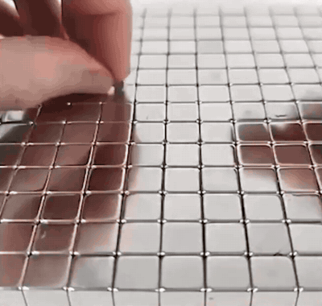

# Цепная передача взаимодействия в сетке магнитов

- **Что показано:** запись опыта с неодимовыми магнитами, расположенными сеткой. Один магнит смещают, и остальные по цепочке реагируют на это смещение: взаимодействие передаётся от магнита к магниту посредством поля.
- **Источник:** TODO (глава монографии и/или видео автора, к которым относится опыт).
- **Версии:** gif — [`magnet-grid-chain-reaction.gif`](magnet-grid-chain-reaction.gif) (около 8 МБ); статичный кадр для каталога — [`preview.png`](preview.png).
- **Автор записи:** неизвестен (запись взята из публичных источников).
- **Участие AI:** gif получен из видеозаписи с помощью AI (Claude, 2026-10-04): кадр обрезан до области опыта (убраны поля и надпись), размер уменьшен до 400 пикселей по ширине, частота — 12 кадров в секунду. Содержание записи не изменялось.
