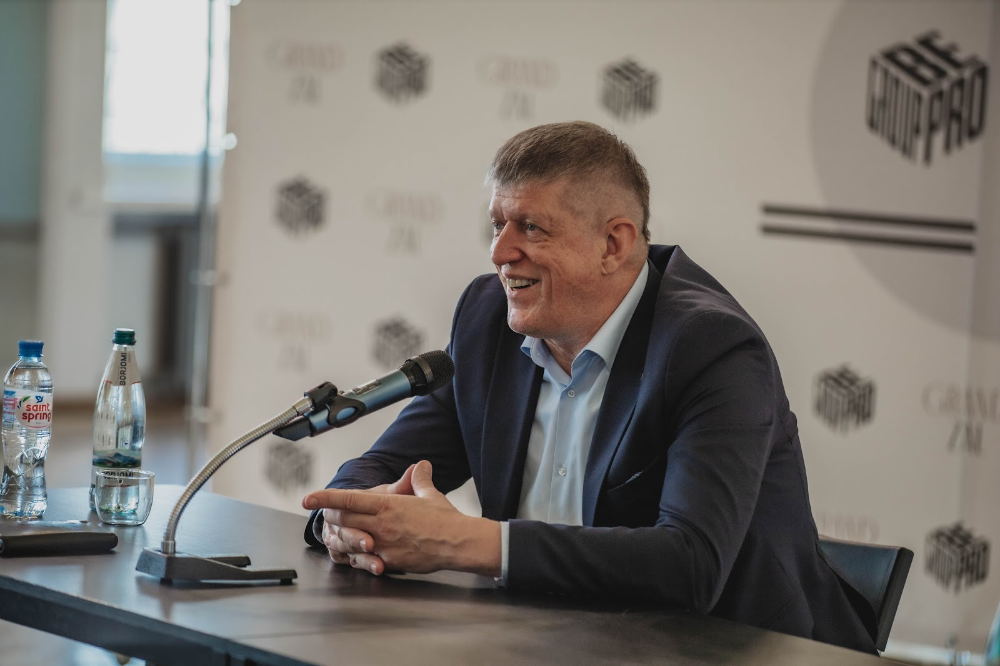

# Виктор Григорьевич Катющик

> Справка составлена с помощью AI (Claude, 2026-10-04) по открытым источникам, главным образом по сведениям, которые Виктор Григорьевич сам публиковал о себе, и по биографии с сайта сообщества vgk18.ru. Человеком не проверена. Просим близких и единомышленников автора уточнить и дополнить её.

*Виктор Григорьевич Катющик на встрече 1 июля 2023 года.* <!-- TODO: указать автора снимка -->

## Кратко

Виктор Григорьевич Катющик — физик-исследователь и художник, автор теории гравитации и монографии «Гравитационное взаимодействие, основы космологии». Жил и работал в Абакане (Хакасия).

## Биографические сведения

- **Дата и место рождения:** 22 июня 1967 года, Красноярск. Позже семья переехала в Хакасию.
- **Служба:** Военно-морской флот, 1985–1988.
- **Образование:** Хакасский технический институт, инженерно-технический факультет. <!-- TODO: уточнить годы учёбы -->

## Научная работа

- Интерес к основаниям физики возник во время учёбы в институте: положения, которые давались на занятиях по физике и по теоретической механике, расходились между собой. Поиск цельной картины стал делом жизни.
- В исследованиях исходил из того, что в точных науках допустимы только строго логические построения, а работа учёного начинается с объективного определения каждого понятия. Этому посвящён его фильм «Научный метод».
- С 1994 года вёл исследования в рамках частного научного проекта «Построение функций характеристик материи». Направления: свойства материи, гравитация, логическое обеспечение искусственного интеллекта, бестопливная энергетика.
- Автор монографии «Гравитационное взаимодействие, основы космологии» — оригинал хранится в [`sources/monograph/`](sources/monograph/gravitatsionnoe-vzaimodeystvie-osnovy-kosmologii.pdf).
- Выступал за пересмотр учебников и учебных пособий по физике и математике; обращался с иском об этом к Министерству образования и науки РФ и Российской академии наук, суд иск к рассмотрению не принял.
- Вёл блог и видеоканал на YouTube («Катющик ТВ»), где публиковал лекции и разборы физических вопросов; автор фильмов «Научный метод» и «Технологии НЛО». Сложные вопросы излагал доступно, с юмором и иронией; выступал с лекциями перед студентами и преподавателями вузов. Среди его подписчиков — студенты и преподаватели, в том числе зарубежные, в области физики, кибернетики, инженерии и космологии. Список видео — в [`sources/videos/videos.md`](sources/videos/videos.md).

## Творчество

- Занимался живописью с 1988 года; работал в жанре сюрреализма. По сведениям из его профиля, включён в список «1000 художников-сюрреалистов всех времён и народов».
- Скульптор, гравёр по металлу, резчик по дереву и кости, ювелир, создатель шарнирных деревянных кукол: разработал оригинальную конструкцию шарнирного механизма, приближенную к движению тела человека.
- В картинах стремился соединить понятное и непонятное; сюжеты предполагают несколько идей одновременно.
- Автор монумента «Погибшим при исполнении» в Абакане.

## Что нужно уточнить

<!-- TODO: заполняется людьми -->

- годы учёбы в институте;
- актуальные ссылки на YouTube-канал и другие площадки автора;
- перечень публикаций и выставок;
- автор снимка и место встречи 1 июля 2023 года (подпись к фотографии).

## Источники

- [Биография на сайте сообщества vgk18.ru](https://www.vgk18.ru/%D0%B2-%D0%B3-%D0%BA%D0%B0%D1%82%D1%8E%D1%89%D0%B8%D0%BA)
- [Профиль в «Живом журнале» (viictor)](https://viictor.livejournal.com/profile/) — сведения автора о себе
- [Страница автора на koob.ru](https://www.koob.ru/katyuschik/)
- [Видеоархив на rideo.tv](https://rideo.tv/katyuschik/)
- Титульный лист монографии ([`sources/monograph/`](sources/monograph/gravitatsionnoe-vzaimodeystvie-osnovy-kosmologii.pdf))
